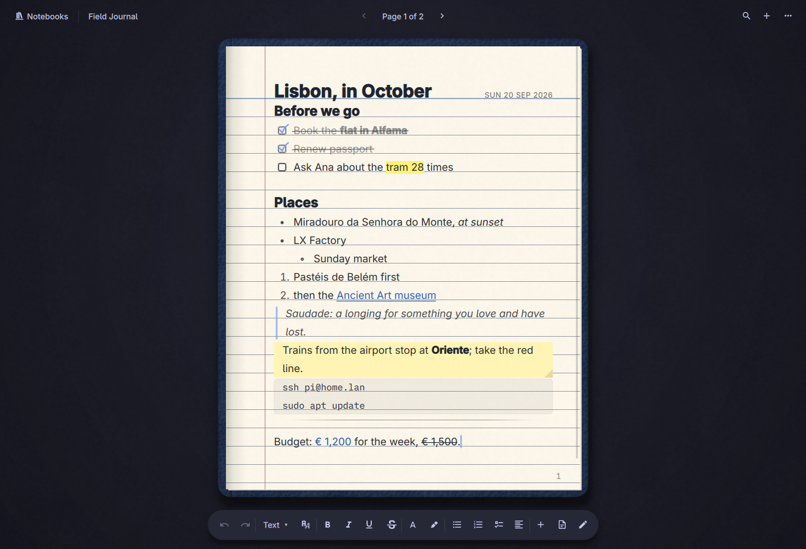

# Omanote for Omarchy



Notebooks that look and feel like paper. Press **Super+N**, or click the
notebook in the top bar, and your notebooks are on the desk, cover up. Pick
one: it slides onto the desk, its cover swings open, and you write on the page
in the pen you like, on ruled, grid, dotted, graph or blank paper. The pages
turn over the binding, the text sits on the lines, and everything is saved as
you go, as plain files you own.

Or switch to **Pages**, the other way to write in Omanote: a workspace of
pages made of blocks, the way Notion does it. Type `/` for any kind of block,
drag blocks around by their handle, put blocks inside blocks and pages inside
pages, fold toggles, color anything.

* **A notebook on your desk.** Pebbled leather with a gold-foil title and an
  elastic band, linen or smooth card with a paper label, kraft with a typed
  stamp, or a marbled composition book with its name box; spiral-bound (wire
  through punched holes), sewn, or hardcover. Twelve cover colors, one of
  them your Omarchy theme's accent.
* **Real paper.** College-ruled with its red margin line, grid, dots, graph,
  a yellow legal pad with its double margin, or blank, on white, ivory, aged,
  yellow, kraft, recycled, night or blueprint paper, or on paper in your
  Omarchy theme's colors. Narrow, college or wide lines. Whatever the font or
  size, every line of text sits on a rule.
* **Pages that turn.** Ctrl+PgDown, or a click on the page's turned-up
  corner, turns the page over the binding, and the next one shows as it goes.
  Turn past the last page for a new one. Give a page an index tab and it
  sticks out of the notebook's edge.
* **Planners and templates.** A page can come laid out: a daily planner with
  your priorities and the day hour by hour, a weekly or monthly planner, a
  habit tracker with a circle to tick for each day, a journal, a to-do list,
  meeting and lecture notes, a project plan, a reading log, a recipe or a
  packing list. Make a notebook of planners and every new page is the next
  day, week or month.
* **Pages, the Notion way.** Every block is an atomic record with a UUID v4
  id; a page is a block too, and pages hold pages. `/` for headings, to-dos,
  toggles, callouts, code, quotes, sub-pages, links to pages, a table of
  contents; ⋮⋮ to drag a block (and what's inside it) anywhere, or turn it
  into another kind, color it, move it to another page; a toolbar over
  selected words; Markdown as you type; code in its language's colors;
  `:rocket:` emoji. A sidebar with the tree of pages and your favorites,
  covers, icons, templates, three fonts, full width, locked pages, search and
  a trash. No databases: just writing, as flexible as it gets.
* **Seven pens.** Clean, Book, Handwriting, Print, Typewriter, Mono and
  Writer: a notebook has one, and any words can have another.
* **Everything a notebook needs.** Headings, bulleted, numbered and
  checklists (ticked by hand, and crossed off), quotes, sticky notes in six
  colors, code, dividers, and pictures you paste, drop or pick. Bold, italic,
  underline, strikethrough, six inks and six highlighters, sizes from 11 to 64, links.
  Markdown shortcuts as you type: `- `, `1. `, `[] `, `# `, `> `.
* **Draw on the page.** A pen, a highlighter and an eraser, over the writing.
* **Find anything.** Search every page of every notebook from the shelf, or
  Ctrl+F on a page.
* **Quick notes.** Super+Alt+N pops up a sticky note wherever you are; what
  you write becomes a page in your Quick notes notebook.
* **Plain files.** Every notebook is a folder of JSON files in
  `~/Documents/Omanote`, pictures beside them; export any notebook as Markdown.

## Screenshots

**The shelf**, and a notebook **opening**:


**Turning a page**, and **drawing** on one:


**Templates**, a **monthly planner** in the handwriting pen, and a **habit
tracker**:


**Pages**: blocks inside blocks, toggles, callouts, colors, code, and the
`/` menu:


Code in its language's colors, and a new page's templates:


**Papers and pens**:


**A new notebook**, a **quick note**, and **search**:


## Requirements

Omarchy 4 (Quattro): the Omarchy shell on Quickshell 0.3 with Qt 6.11, and
Hyprland 0.56 or newer with its Lua configuration. Everything else it uses
ships with Omarchy: `wl-copy` and `wl-paste`, `grep`, `bash`, `uwsm-app` and
`xdg-open`, and the iA Writer and Noto fonts. Its own fonts come with it.
Nothing to build.

## Install

```bash
omarchy plugin add https://github.com/marcho78/omanote.git --enable
```

That's all: no setup step, and your Hyprland config is not touched. Omanote
registers its shortcuts and window rules with Hyprland while it runs and takes
them back out when you disable it. It's in your app launcher too, as
*Omanote*, with its notebook icon. Enabling puts the notebook icon on the
right of the bar; move it with `omarchy bar move marcho78.omanote --section
left`. Omarchy keeps a plugin with a bar icon on for as long as the icon is in
the bar, so to keep Omanote without the icon, turn off **Show Omanote in the
top bar** in its settings: the icon then takes no space.

The first time it opens, Omanote makes a notebook for you with a page of
things to try.

## Use

| To | Do |
|---|---|
| Open or close your notebooks | **Super+N**, click the notebook in the top bar, or *Omanote* in the app launcher |
| Jot a quick note from anywhere | **Super+Alt+N**, or right-click the notebook in the bar |
| Open a notebook | Click it on the shelf |
| Back to the shelf | **Ctrl+W**, or *Notebooks* at the top left |
| Turn the page | **Ctrl+PgDown** / **Ctrl+PgUp**, **Alt+→** / **Alt+←**, or click the page's bottom corner |
| A new page | **Ctrl+N**, or turn past the last page (a planner's next day, week or month) |
| A page from a template | **Ctrl+T**, or **+** at the top right: a planner, a habit tracker, a journal, a list... |
| Every page in the notebook | **Ctrl+G**, or click *Page 3 of 12*: jump to one, move pages up and down |
| Find on this page | **Ctrl+F** (Enter for the next, Shift+Enter for the one before) |
| Search every notebook | Type in the search on the shelf |
| Draw | **Ctrl+Shift+D**, or the pen in the bar at the bottom: **P** pen, **M** highlighter, **E** eraser, Esc to write again |
| Change the paper | The page icon in the bar at the bottom, for this page or every page |
| An index tab on a page | ⋯ at the top right, then *Add a tab* |
| A notebook's cover, paper and pen | Its title at the top, or right-click it on the shelf |
| A new notebook | **Ctrl+Shift+N**, or *New notebook* on the shelf |
| Bigger or smaller | **Ctrl+=** / **Ctrl+-**, **Ctrl+0** to reset |
| Settings | **Ctrl+,**, or the cog on the shelf |
| Pages | *Pages* in the switch at the top right of the shelf (and *Notebooks* at the top of the Pages sidebar to go back) |
| Put Omanote away | **Esc** on the shelf, **Super+N**, or close the window |

Closing the window, or Omanote, keeps your place: it opens where you were.

## Writing

Type straight onto the page. Each paragraph, heading or list item is a block,
and the bar at the bottom shows the formatting where the cursor is.

**Markdown shortcuts**, typed at the start of a line and then a space:

| Type | For |
|---|---|
| `- ` or `* ` | a bulleted list |
| `1. ` | a numbered list (1, a, i as it goes deeper) |
| `[] ` or `[x] ` | a checklist item |
| `# `, `## `, `### ` | a title, a heading, a subheading |
| `> ` | a quote |
| `!! ` | a sticky note |
| ```` ``` ```` | code |
| `---` and Enter | a divider |
| `9:30 ` | a time slot at half past nine |

**Keys:**

| Keys | Do |
|---|---|
| Ctrl+B, Ctrl+I, Ctrl+U | bold, italic, underline |
| Ctrl+Shift+>, Ctrl+Shift+< | bigger, smaller text (or the size menu in the bar: 11 to 64) |
| Ctrl+Shift+X | strikethrough |
| Ctrl+Shift+H | highlight |
| Ctrl+E | code |
| Ctrl+K | a link (Ctrl+click a link to open it) |
| Ctrl+\\ | plain text again |
| Ctrl+Alt+1, 2, 3, 0 | title, heading, subheading, text |
| Ctrl+Shift+8, 7, 9 | bulleted, numbered, checklist |
| Ctrl+Enter | tick (or untick) a checklist item, or tick today off a habit |
| Tab, Shift+Tab | indent and outdent a list item |
| Shift+Enter | a new line in the same block |
| Ctrl+; | today's date |
| Ctrl+Shift+V | paste as plain text |
| Esc | pick the whole block; then Shift+↑/↓ picks more, Delete removes them, Alt+Shift+↑/↓ moves them, Ctrl+D duplicates them |
| Ctrl+A twice | pick every block |
| Ctrl+Z, Ctrl+Shift+Z | undo, redo |

Formatting with nothing selected applies to what you type next. Text too big
for one ruled line takes two or more, the way big writing does in a real
notebook, so it never runs into the line above. Enter on an
empty list item ends the list; Backspace at the start of a list item makes it
text again. Dragging from one block into another picks whole blocks. Pictures
come in by pasting them, dropping them on the page, or *Picture…* in the
**+** menu; click one to size it (drag its corner), place it, or remove it.

## Templates and planners

**+** at the top right (or **Ctrl+T**) shows every kind of page in
miniature, on your paper. Pick one with a click, or the arrows and Enter: it
goes on the page you're on while that's still blank, else on a new page
after it.

| Template | What's on it |
|---|---|
| Daily planner | the day as its title, top priorities, a schedule from 7:00 to 20:00, to-dos, notes |
| Weekly planner | the week's focus, each day with its to-dos, habits, notes |
| Monthly planner | the month's calendar, goals, a line for each day of the month, notes |
| Habit tracker | eight habits, each with a circle for every day of the week |
| Journal | what you're grateful for, what would make today great, a highlight, what you learned |
| To-do list | today, this week, someday |
| Meeting notes | who, agenda, notes, decisions, action items |
| Lecture notes | questions and keywords, notes, a summary |
| Project plan | the goal, milestones, tasks, risks, notes |
| Reading log | reading now, up next, favorite lines |
| Recipe | serves and time, ingredients, method, notes |
| Packing list | documents, clothes, toiletries, tech |

Everything on them is ordinary writing: type over it, move it, format it or
delete it. Empty parts show a faint hint of what they're for.

**A notebook of planners.** Choose *Pages* when you make a notebook (or in
its *Cover, paper and pen*): a daily, weekly or monthly planner, a habit
tracker, a journal, to-dos, meeting or lecture notes. Its first page is
today's, and each new page (**Ctrl+N**, or turning past the last) is the next
day, week or month, never one in the past: come back after a week away and
the next page is today's. Any page can still be another kind.

**Time slots.** A schedule's times sit in the margin. Enter at the end of a
slot goes to the next one, and after the last starts another an hour on (or
as far on as the slots before it: half-hourly stays half-hourly); click a
time to change it. Type `9:30 ` at the start of a line for a slot of your own.

**Habits.** Click a day's circle to tick it off, again to untick it;
**Ctrl+Enter** ticks today. Enter adds another habit.

**Calendars.** Today has a dot of color. Click a date to circle it, again to
rub it out; the arrows (when the pointer is over it, or it's picked) turn it
to another month. *Month calendar* in the bar's **+** menu puts one on any
page, as *Habit to track* and *Time slot* do those.

## Pages

Pages is the other way to write in Omanote: not a notebook on a desk, but a
workspace of pages, the way Notion does it. Switch to it with *Pages* at the
top right of the shelf; Omanote opens where you were last, notebooks or pages.

**Everything is a block.** A line of text, a heading, a to-do, a toggle, a
callout, a picture, a page: each is an atomic record with its own id (a UUID
v4), its type, what it says, the blocks inside it and the block it's in. A
page is a block too, and a page inside a page is a *page* block on it. Blocks
inside a block go wherever it goes: dragged, moved, copied or deleted, it
takes them along.

| To | Do |
|---|---|
| A new block of any kind | Type **/** (then a few letters of its name: `/todo`, `/h2`, `/toggle`, `/page`, `/red`), or **+** beside a block |
| Move a block | Drag **⋮⋮** beside it (hover over the block); drag it right to put it inside the block above |
| Columns | Drag a block up the right side of another: the two go side by side (drop more beside them for up to six). Or `/2 columns` … `/5 columns`. Drag the gap between two columns to share the width differently |
| Turn it into another kind, color it, duplicate it, move it to another page, delete it | Click **⋮⋮** |
| Put a block inside the one above it, or take it out | **Tab**, **Shift+Tab** |
| Fold a toggle, or unfold it | Click its arrow, or **Ctrl+Enter** |
| Bold, italic, underline, strikethrough, code, a link, a color | Select the words: a toolbar comes up over them (or the notebook's shortcuts: Ctrl+B, Ctrl+I…) |
| Markdown as you type | `**bold**`, `*italic*`, `` `code` ``, `~~struck~~`; at the start of a line `# `, `- `, `1. `, `[] `, `> ` (a toggle), `" ` (a quote), ```` ``` ```` |
| Text, headings, to-do, bulleted, numbered, toggle, code | **Ctrl+Alt+0**…**3**, **4**, **5**, **6**, **7**, **8** |
| Move a block up or down | **Alt+Shift+↑/↓** |
| A new page | **Ctrl+N**, *New page* in the sidebar, or **+** beside a page there for one inside it |
| A page inside this page | `/page` |
| A date in a line | **@** and a date: `@tomorrow`, `@fri 3pm`, `@in 2 hours`, `@oct 3`, `@2026-12-24` |
| A reminder | **@** and a date, then *Remind me*: an Omarchy notification then (click it to open the page) |
| A link to a page in a line | **[[** and part of its name (or a new name, for a new page); click the link to go there |
| An emoji | **:** and part of its name: `:rocket`, `:tada`, `:+1` (pick one, or type the whole name and a closing `:`) |
| Ask your agent | The AI button at the top of the page, **Ctrl+J**, `/agent`, or *Ask agent* in a block's ⋮⋮ menu, on the toolbar over selected words, or in the page's ⋯ menu: Omarchy's default coding agent (Claude Code, Codex, OpenCode...) does it, and its changes show up on the page (see [For AI agents and scripts](#for-ai-agents-and-scripts)) |
| Start a page from a template | On a new, empty page: pick one under *Start with a template* (a daily, weekly or monthly planner, a journal, a habit tracker, meeting or lecture notes, a project plan, a to-do list, a reading log, a recipe, a packing list). Each is laid out as a page: sections side by side, a callout for the one thing that matters, the day hour by hour, habits to tick, the month's calendar, and on every empty line, faintly, what goes there. **Ctrl+Z** takes it back off |
| A mind map | `/mindmap`, or *Turn into mind map* in a nested list's ⋮⋮ menu (the top item is the topic, the items inside it the ideas). Click an idea to write on it: **Enter** adds the next idea, **Tab** one branching from it, **Shift+Tab** moves it out a level, **↑ ↓** move between ideas, **Backspace** on an empty idea takes it away, **Ctrl+Backspace** an idea and its branch, **Esc** stops. The color button over the idea you're writing on gives it a text color and a background (a main idea's color is its whole branch's): one of Pages' colors (which follow your light or dark theme), one you picked recently, or **Custom…**, a color picker (saturation and brightness, hue, a hex to type or paste, and how well the idea's text reads on it) that shows the color on the map as you pick it; **Enter** or *Apply* keeps it, **Esc** or *Cancel* puts back what was there. Text on a background with no text color of its own is made readable. The circle at an idea's end folds its branch. The block's own ⋮⋮ *Color* puts a background behind the whole map, or sets the text color of ideas with none of their own. *Turn into list* (⋮⋮) makes it a nested list again |
| A table | `/table` (or paste cells from a spreadsheet, or a Markdown table). Click a cell to write in it: **Tab** and **Shift+Tab** go to the next and previous cell (**Tab** in the last one makes a new row), **Enter** goes down a row (past the last, a new one), **Shift+Enter** is a new line in the cell, the arrows cross into the next cell at a cell's ends and leave the table at its top and bottom, **Esc** picks the whole table. **Ctrl+B**, **Ctrl+I**, **Ctrl+U**, **Ctrl+Shift+X** and **Ctrl+E** format what's selected in a cell (the toolbar over selected words is for text blocks). Point at a cell: the handle on its row's left and on its column's top open their menus (insert above or below, left or right; move; delete; *Header row* on or off), the **+** bars along the bottom and the right add a row or a column, and the lines between columns drag to make them wider. Colors: the color button on the cell you're in, or *Color* in a row's or a column's menu, gives a text color and a background: one of Pages' colors (which follow your light or dark theme), one you picked recently, or **Custom…**, the color picker (shown in the table as you pick, with how well the text reads; **Enter** keeps it, **Esc** puts back what was there). Cells pasted from a spreadsheet into a cell fill the table from there, and it grows to take them |
| Go back to an earlier version | *Page history* in the page's ⋯ menu: the versions Omanote kept (every ten minutes while you write, and before an agent or a command changes the page), each shown as it was. *Restore this version* puts it back as one step **Ctrl+Z** takes back, and keeps the page as it was in the history too. Pages made inside the page since stay in it |
| A habit to keep | `/habit`: its name, and a circle for each day of the week to click when it's done (today's is rimmed in your accent) |
| A month at a glance | `/calendar`: click a date to circle it; the arrows over it go to other months |
| Turn a block into a page | **⋮⋮** → *Turn into page*: its text is the page's name, and what's inside it goes along |
| Keep a page at hand | The ☆ at the top right, or *Add to Favorites* in its menu: it's under *Favorites* at the top of the sidebar |
| Copy a page | *Duplicate* in its ⋯ menu (or in the sidebar's): a copy of it and the pages in it, right after it |
| Stop a page changing | *Lock the page* in its ⋯ menu: it reads, and copies, but can't be changed until you unlock it (the lock at the top) |
| Bring notes in | *Import…* at the foot of the sidebar: files, or a whole folder (a Notion or Obsidian export, zipped or not). Or drop files on a page |
| Paste Markdown | It comes in as blocks. Into a page's title: the first line is the title, the rest the page |
| Find a page | **Ctrl+P**: recent pages, or every page with the words you type |
| Back, forward | **Alt+←**, **Alt+→** |
| Hide or show the sidebar | **Ctrl+\\** |

**Blocks**: text, columns side by side, three sizes of heading (and toggle
headings, which fold what's under them), bulleted, numbered (1, a, i as they nest) and to-do
lists, toggles, quotes, callouts with an emoji (click it for another), code
with its language (in its colors: 30 languages, from Bash to Zig) and a Copy button, dividers, pictures (pasted, dropped or
picked), pages, links to pages, a table of contents of the page's
headings, habits with a circle for each day of the week, a month's
calendar, mind maps (the topic in the middle, ideas branching out in a
color for each branch, laid out by themselves), and tables (rows and
columns, a header row, columns as wide as you drag them, cells in a text
color and a background of their own, and the cells' words formatted like
any other). Nine text colors and nine backgrounds (Notion's), for a whole block
or a few words; a callout or a colored block keeps the blocks inside it in
its color.

**Links and reminders.** A page shows the pages that link to it (with `[[`
or a *Link to page* block) under its title, and a link to a page always says
the page's name now, however often it's renamed. Reminders come whenever
they're due while the Omarchy shell runs (Omanote keeps them, so taking the
date off the page takes the reminder away too); one that came due while the
computer was off comes when it starts, if that was in the last 12 hours.

**Bringing notes in.** Import reads Markdown (Notion's, Obsidian's,
GitHub's: headings, bold, italics, strikethrough, `==highlights==`, code,
links, nested lists, to-dos ticked or not, quotes, `> [!NOTE]` callouts,
`<details>` toggles, code blocks with their language, tables, front matter),
HTML (Notion's export too, which keeps its colors, toggles, callouts and
columns), plain text, Evernote's `.enex`, and Word, OpenDocument, RTF and
more through LibreOffice (which Omarchy has) or pandoc. A folder's tree
becomes pages inside pages, with a Notion page's own folder inside it; pages
keep Notion's ids as their UUIDs; links between the files (and
`[[wikilinks]]`) become links between the pages; pictures are copied in.
Tables come in as tables, their cells' bold, links and line breaks kept;
pictures on the web stay links (Omanote never goes online).

**A page** has an icon (an emoji), a cover (a gradient or a picture of your
own), a title, and a look of its own in its ⋯ menu: the Default, Serif or
Mono font, small text, and full width. The same menu copies it as Markdown,
exports it and the pages in it (as Markdown files, to a folder you pick or to
`Exports/`, as Settings → Exports says), moves it into another page, or puts it
in the trash. The sidebar shows every page as a tree; the trash at its foot puts a
page back where it was, or deletes it from Pages.

Pages follows your Omarchy theme, light or dark.

## Paper, pens and covers

A notebook has a paper and a pen; any page can have its own paper, and any
words their own pen and size.

| Paper | |
|---|---|
| Patterns | Blank, Ruled, Grid, Dots, Graph, Legal pad |
| Colors | White, Ivory, Aged, Legal yellow, Kraft, Recycled, Night, Blueprint, your Omarchy theme |
| Lines | Narrow, College, Wide |

The inks and highlighters you pick are kept as their light-paper colors and
shown as a matching lighter ink on dark paper, so switching a page to night
paper never leaves dark ink on a dark page.

| Pen | Font |
|---|---|
| Clean | Adwaita Sans (else Inter, Noto Sans) |
| Book | Lora |
| Handwriting | Caveat |
| Print | Patrick Hand |
| Typewriter | Special Elite |
| Mono | iA Writer Mono |
| Writer | iA Writer Duo |

Covers come in leather, linen, kraft, smooth card and composition, in twelve
colors, with or without an elastic band, spiral-bound, sewn or hardcover.
Titles go on the way the material takes them: stamped in foil, written on a
label with a marker, typed onto kraft, written in a composition book's name
box.

## Where your notebooks are

In `~/Documents/Omanote` (or `~/Omanote` without a Documents folder), unless
you pick another folder in the settings:

```
Omanote/
  library.json                  the order of the shelf
  my-notebook-k3f9/
    notebook.json               its title, cover, paper, pen, kind of page and pages in order
    pages/20260930-143201-a8f2.json
    assets/20260930-150412-p7wq.png
  Pages/
    index.json                  the tree of pages: titles, icons, which page is in which
    6f1c2b9e-….json             a page of Pages, named by its UUID
    history/6f1c2b9e-…/         its earlier versions, a file each, named for when they were kept (the newest 100)
    assets/                     pictures and covers on Pages' pages
  .trash/                       notebooks and pages you threw away
  Exports/                      notebooks and pages exported as Markdown (with Settings → Exports on "Exports folder")
```

A page of Pages is its blocks as Notion keeps them: the ids of the blocks on
the page in order (`content`), and every block by its id (`blocks`), each with
its `type`, its `parent`, what it says, and the ids of the blocks inside it:

```json
{
 "id": "6f1c2b9e-0d3a-4f6e-9b1c-2e8a7d5f4c3b", "type": "page", "parent": "",
 "title": "Plans", "icon": "🗺️", "content": ["a3e1…", "c07d…"],
 "blocks": {
  "a3e1…": { "id": "a3e1…", "type": "toggle", "parent": "6f1c…", "html": "Trip", "content": ["9b4f…"] },
  "9b4f…": { "id": "9b4f…", "type": "check", "parent": "a3e1…", "html": "Tickets", "checked": true },
  "c07d…": { "id": "c07d…", "type": "page", "parent": "6f1c…" }
 }
}
```

A page's file holds its title, its blocks (each block's text as Qt writes rich
text: `Hello <span style="font-weight:700;">bold</span>`), its drawings, its
paper and tab, the template it came from and the day it's for, and its plain
text for searching. Files are written whole, to a
temporary file that then replaces them, so a crash never leaves half a page.
Nothing is ever deleted: throwing a page or notebook away moves it to
`.trash`.

*Export notebook…* (⋯, or right-click on the shelf) writes each page as a
Markdown file, with its pictures, into a folder of its own, and opens it. Where
that folder goes is a setting (Settings → Exports): a folder you pick each time
(the default), or `Exports/` in your notebooks folder.
*Copy page as Markdown* puts the page on the clipboard. Highlights come out as
`==marked==`, sticky notes as `> [!NOTE]` callouts, checklists as `- [ ]`,
time slots as a list with the times in bold, habits as a table of the week and
a calendar as a table of the month.

## Settings

They apply as you change them and are saved on Omanote's entry in
`~/.config/omarchy/shell.json`, keeping only what differs from the defaults
in `Defaults.js`.

| Setting | Default | Values |
|---|---|---|
| `shortcut` | `SUPER + N` | any modifiers and a key, or empty |
| `quickShortcut` | `SUPER + ALT + N` | any modifiers and a key, or empty |
| `barIcon` | `true` | show the notebook in the top bar |
| `folder` | `""` | where the notebooks live (`""` is `~/Documents/Omanote`); `/path` or `~/path` |
| `floating` | `true` | float in the middle of the screen (`false`: tile) |
| `width`, `height` | `1320`, `900` | the floating window's size |
| `strikeDone` | `true` | cross off checked items |
| `sounds` | `true` | a soft paper sound when a page turns and a notebook opens |
| `reduceMotion` | `false` | fade instead of turning pages and swinging covers |
| `zoom` | `100` | 60 to 200 |
| `space` | `notebooks` | which Omanote opens in: `notebooks` or `pages` (the one you were in) |
| `recentColors` | `""` | the colors of your own you picked last in a mind map, newest first (up to 8) |
| `exportTo` | `ask` | where exports go: `ask` (a folder picker each time) or `folder` (`Exports/` in your notebooks folder) |
| `inbox` | `""` | the page agents' and scripts' new pages go into: made (as *Inbox*) the first time; `omarchy-shell omanote set inbox <page id>` makes it another page |
| `pen`, `paper`, `paperColor`, `spacing`, `cover`, `material`, `binding` | `sans`, `ruled`, `ivory`, `regular`, `navy`, `leather`, `spiral` | what a new notebook starts with (the choices of the last one you made) |

A shortcut another binding already uses is left alone, and the settings say
which. A shortcut needs a modifier, unless it's a function or media key.

### From a terminal

```bash
omarchy-shell omanote toggle              # or show, hide
omarchy-shell omanote quick               # the quick-note card
omarchy-shell omanote quick "Buy milk"    # straight into Quick notes
omarchy-shell omanote search "tram 28"
omarchy-shell omanote shelf
omarchy-shell omanote pages               # straight to Pages
omarchy-shell omanote open <page id>      # a page in Pages (what a reminder's notification does)
omarchy-shell omanote importNotes ~/notes # files or a folder (a Notion or Obsidian export) into Pages
omarchy-shell omanote settings
omarchy-shell omanote set paper grid      # any setting above
omarchy-shell omanote reset               # every setting back to its default
omarchy-shell omanote status
```

A quick note's first line is its title; lines starting with `- ` become a
list and `[] ` a checklist.

### For AI agents and scripts

An AI agent, a script, a keybinding or a cron job can read and write your
pages with the same `omarchy-shell omanote` calls, with no MCP server or anything
else running: the commands go to Omanote over the Omarchy shell's IPC, and the
app does the writing, so a page shows up in the window as it's added, and its
links and reminders work. Each command answers at once, in JSON (`read` gives
Markdown).

```bash
omarchy-shell omanote help                        # the commands, as JSON
omarchy-shell omanote list                        # every page: id, title, icon, path
omarchy-shell omanote find "lisbon tram"          # pages with those words, with a snippet
omarchy-shell omanote read <page id>              # a page as Markdown
omarchy-shell omanote add "Title" ~/note.md       # a new page in the Inbox, from a Markdown file
omarchy-shell omanote addTo <page id> "" note.md  # a new page inside a page ("": its # heading is the title)
omarchy-shell omanote append <page id> more.md    # added at the end of a page
omarchy-shell omanote blocks <page id>            # its blocks: id, type, depth, text (Markdown)
omarchy-shell omanote replace <page id> <block id> new.md      # in place of a block (and what's inside it)
omarchy-shell omanote insertAfter <page id> <block id> more.md # after a block, as deep as it is
omarchy-shell omanote trash <page id>             # to the trash, where it can be put back
```

Pages come in as Markdown files, since an argument can't carry a page. They
keep their headings, nested lists, to-dos and ticks, code with its language and
callouts. A `mindmap` code block (an outline: the topic, then each idea
indented two spaces under the one it branches from; or Mermaid's `mindmap`) is
a mind map, so "make me a mind map of…" puts one on a page. An idea's colors
go in braces after it: `Marketing {red}`, `Marketing {blue background}`,
`Marketing {red, yellow background}`, or any hex color, `Marketing {#ff8800}`. A Markdown table (`| a | b |` lines, the second `|---|---|`) is a
table, its first row the header. `[[Page title]]` links to the page called that. A date is
`[@Fri 2 Oct](omanote://date/2026-10-02)`, and a reminder is
`[⏰ Fri 2 Oct 9:30](omanote://remind/2026-10-02T09:30)`: a notification at
that time. `add` puts pages in an Inbox page at the top of Pages, made the first
time it's needed; move them anywhere. Nothing is deleted for good, a locked
page isn't changed, and the page as it was is kept in its *Page history*
before a command changes it. On the page you have open, what's added goes in as one step
you can undo, and your cursor stays where it is.

`replace` and `insertAfter` won't change columns themselves (only what's in
them), and `replace` won't take a block with a page inside it.

**Ask your agent, from Omanote.** In Pages, the AI button at the top of the page, **Ctrl+J**, `/agent`, *Ask agent*
in a block's ⋮⋮ menu, *Ask* on the toolbar over selected words, or *Ask agent
about this page* in the page's ⋯ menu opens a box for what you'd like (or a
suggestion: to-dos, a summary, carrying on writing, linking related pages).
It goes to Omarchy's default coding agent, whichever you chose with
`omarchy default agent` (Claude Code, Codex, OpenCode, Gemini, Crush, Cursor,
Pi...), which opens in its own terminal and does it with the commands above,
so what it changes shows up on the page as it goes, each change a step you can
undo. The box says which agent it is; click it to choose another of the agents
installed here (Omarchy's list of them). That makes it Omarchy's default agent
too, and opens nothing. The agent gets the page's id, the
ids of the blocks you picked (or the empty line you're on, where its writing
goes), the words you selected, and where the omanote skill is; it reads the
rest itself. Omarchy starts it the way it starts every agent from a menu, with
its approval prompts off, so it can also do whatever else your agent can on
your computer; Omanote's commands keep your notes safe from it (nothing
deleted for good, no locked page changed, every change undoable).

**The skill.** While Omanote runs, it links its skill (`skills/omanote`) into
the folders agents read skills from, the ones Omarchy links its own into:
`~/.agents/skills`, `~/.claude/skills`, `~/.codex/skills`, `~/.hermes/skills`
and `~/.pi/agent/skills`, where those folders exist and nothing called
`omanote` is there already. It takes its links out again when it stops.
Agents that don't read skills get the file's path in the prompt.

**Claude Code** asks before each command unless you allow them in
`~/.claude/settings.json` (leave `trash` out, so that one still asks):

```json
"permissions": {
  "allow": [
    "Bash(omarchy-shell omanote find:*)", "Bash(omarchy-shell omanote list:*)",
    "Bash(omarchy-shell omanote read:*)", "Bash(omarchy-shell omanote add:*)",
    "Bash(omarchy-shell omanote addTo:*)", "Bash(omarchy-shell omanote append:*)",
    "Bash(omarchy-shell omanote blocks:*)", "Bash(omarchy-shell omanote replace:*)",
    "Bash(omarchy-shell omanote insertAfter:*)"
  ]
}
```

## How it works

Omanote is QML and JavaScript, two small shaders and a small Hyprland Lua
file; nothing is built on your machine. It runs inside the Omarchy shell: a
service with the settings, the Hyprland registration and the notebooks on
disk (`Service.qml`, `Store.qml`), a panel with the notebook window and the
quick-note card (`Notebook.qml`, `app/`), and the icon in the bar.

* **The page** is a column of blocks, each its own Qt rich-text editor
  (`app/Block.qml`); `app/Editor.qml` decides what keys do across them (Enter
  splits a block, Backspace at its start joins it to the one above, the
  arrows move between them), formats text, pastes, picks whole blocks and
  keeps the undo history. Formatting works on the selection's HTML, read into
  runs of text and written back (`Html.js`), so bolding a heading-sized word
  together with body text keeps both sizes.
* **Text on the lines.** Every line of every block has a fixed height, a whole
  number of rules, and Qt puts a fixed-height line's baseline at four fifths
  of it, whatever the font: that's where the paper's rules are drawn. A title
  takes two rules and moves down a fifth of one, so it sits on the second.
* **The paper** is a fragment shader (`shaders/paper.frag`): the color, a
  grain of noise, kraft's fibers, and the pattern, with each rule one device
  pixel wide. The covers are another (`shaders/cover.frag`): leather's
  pebbles, linen's weave, kraft's fibers, the composition book's marbling,
  stitching and the spine. The spiral, tabs, checkboxes and ticks are drawn
  with Qt Quick Shapes.
* **Turning a page** takes a picture of the page, puts the next page under it
  and turns the picture over the binding in 3D with light and shadow across
  it; turning back, the earlier page comes over a picture of this one. The
  cover opens the same way, around the spine.
* **Pages** is the same editor in another layout: blocks with natural
  spacing instead of ruled lines (`app/DocBlock.qml`), each block's depth
  telling which block it's inside. `Workspace.js` turns a page's tree of
  blocks into that list and back, keeps depths that make sense, and checks
  page files and the tree of pages; `Workspace.qml` reads and writes them,
  through the same atomic writes as the notebooks; `Docs.js` has Pages' type,
  colors and "/" commands. `Dates.js` reads the dates typed after "@",
  `Emoji.js` has the emoji names for ":", and `Import.js` reads the notes you
  bring in. Code is stored as plain text and colored as it's shown, by
  `Highlight.js`: a small reader for each language that finds its comments,
  strings, numbers, keywords, types, functions and tags, and never changes a
  character (it colors again a moment after you stop typing). `Api.qml`
  answers the commands agents and scripts send over IPC, through the same
  store as the window, and `Agent.js` writes what *Ask agent* hands your agent.
  A mind map keeps its ideas as an outline; `Mindmap.js` reads it (and
  Mermaid's), changes it and lays it out, and `app/MindMap.qml` draws it and
  lets you write on it. A table keeps its rows of cells (each a little rich
  text), whether its first row is a header, and its columns' widths;
  `Table.js` cleans and changes it (its cells' colors too, which go with
  their rows and columns; and it reads spreadsheet cells and writes
  Markdown, which has no colors), and `app/TableBlock.qml` draws it and lets you write in it.
  `Workspace.qml` keeps each page's earlier versions in `Pages/history/`, and
  `app/HistoryPanel.qml` shows them and puts one back.
* **Blocks** (`Blocks.js`) know how Enter, Backspace and numbering work for
  each kind; **templates**, and the dates planners go on by, are in
  `Templates.js`; **papers, pens and inks** are in `Papers.js`, **covers** in
  `Covers.js`, and **what the files may hold** in `Library.js`, which checks
  everything read from disk before anything uses it.
* `hypr/omanote.lua` registers the shortcuts as messages to the service over
  Hyprland's event socket (`hl.dsp.event`), and window rules that float the
  notebook in the middle of the screen at your size, keep it fully opaque
  (paper isn't see-through), float the picture picker, and take the border
  and shadow off the quick-note card. The service runs it with `hyprctl eval`
  when the shell starts, after every Hyprland config reload, and when you
  change the shortcuts or window settings; disabling Omanote removes it all.
* **Sounds** are made from noise and sine waves by `sounds/make`, so there are
  no recordings in it.

## Security

Omanote runs as unsandboxed code in the Omarchy shell, like every shell
plugin, so here is exactly what it does.

**No network, no root, nothing compiled on your machine.** Links you Ctrl+click
open in your browser; Omanote itself never connects anywhere.

**Programs.** Every command runs by absolute path with an argument list:

| Program | Why |
|---|---|
| `/usr/bin/bash` | three fixed scripts: one prints the files it's handed (or that a fixed pattern matches in a notebook's folder), each after its name, so a notebook is read in one go; one lists the page files in the Pages folder; the other points `wl-paste`'s output at a new picture file. Your text is never part of a script |
| `/usr/bin/cat` | read files, from that script |
| `/usr/bin/grep` | find the pages that contain what you searched for (`-F`: plain text, never a pattern) |
| `/usr/bin/mkdir`, `/usr/bin/cp`, `/usr/bin/mv`, `/usr/bin/test` | make notebook folders, copy pictures in and out, move things to the trash, see if there's a Documents folder |
| `/usr/bin/wl-copy`, `/usr/bin/wl-paste` | copy a page as Markdown; paste a picture |
| `/usr/bin/uwsm-app` with `xdg-open` | open a link, a picture or a folder the way Omarchy's launcher does |
| `/usr/bin/hyprctl` | read Hyprland's bindings; register and remove the shortcuts and rules |
| `/usr/bin/omarchy-shell` | say "Saved to Quick notes" on the OSD |
| `/usr/bin/omarchy-notification-send` | a reminder from Pages, as an Omarchy notification; clicking it runs `omarchy-shell omanote open <page id>` |
| `/usr/bin/find`, `/usr/bin/unzip` | list the files in a folder you import; unpack a zipped export (into a folder of your own under `$XDG_RUNTIME_DIR`, removed afterwards with `/usr/bin/rm`) |
| `/usr/bin/soffice` or `/usr/bin/pandoc` | turn a Word, OpenDocument or RTF file you import into HTML or Markdown, in that same folder |
| `/usr/bin/rm` | take Omanote's launcher entry out when it stops |
| `/usr/bin/setsid`, `/usr/bin/kill` | run each command in its own process group, with a deadline and an output budget, and end it if it overruns them |

What you type reaches `grep` as a separate argument after `-e`, so it can
never be read as an option. Paths are checked before they're used: notebook
and page ids are plain lowercase names, pictures must be in their notebook's
`assets` folder, and dropped or picked pictures must be absolute image paths.

**Commands.** The IPC commands for agents and scripts (`add`, `addTo`,
`append`, `replace`, `insertAfter`) read the Markdown file they're given, by its
full path, up to 2 MB, as text; they don't run it or follow anything in it.
They reach Omanote over the Omarchy shell's IPC, which only programs running
as you can use, and they can add, append, change blocks and put pages in the
trash, never delete a page for good or change a locked one.

**Your agent.** Omanote starts an agent only when you ask (Ask agent), and
only Omarchy's default one, by running `/usr/bin/omarchy-agent-prompt` with
the prompt as one argument; it reads which agent that is with
`/usr/bin/omarchy-default-agent`, and *Change* runs `/usr/bin/omarchy-menu
summon setup.default.agent`. The agent runs as Omarchy runs it, with its
approval prompts off, so it can do on your computer whatever that agent can;
the prompt holds the page's and blocks' ids and the words you selected, never
the rest of your notes.

**Files.** Omanote writes inside its notebooks folder, and, outside it: its
launcher entry, `~/.local/share/applications/marcho78-omanote.desktop`, and a
link named `omanote` to its skill in each of `~/.agents/skills`,
`~/.claude/skills`, `~/.codex/skills`, `~/.hermes/skills` and
`~/.pi/agent/skills` that exists (never over anything already called that),
all made when it starts and removed when it stops (only links to its own
skill are removed). A fixed `/usr/bin/bash` script does the links with
`/usr/bin/ln`, `/usr/bin/readlink` and `/usr/bin/rm`. Its settings are written by
the Omarchy shell to Omanote's entry in `shell.json`. Every file it
reads is checked by `Library.js` or `Workspace.js` (types, sizes, counts,
known values, UUIDs, a tree with no block or page inside itself), and the
text of every block is cut down to the formatting Omanote writes itself
(no pictures, stylesheets or scripts inside text, and only `http`, `https`,
`mailto` and `file` links), so a damaged, hand-edited or synced-in page can't
make it load anything. Pasted text keeps what it says (bold, italic, links)
and drops how the page it came from looked. Every title, label and name is
drawn as plain text.

## Development

```bash
tests/run          # settings, HTML, blocks, papers, library, Markdown,
                   # templates, Pages and the Hyprland module (node, lua),
                   # and the editor, notebook and Pages
                   # driven with keys and the mouse, offscreen (qmltestrunner)
shaders/build      # recompile the shaders (needs qt6-shadertools)
sounds/make        # make the sounds again
```

The Omarchy shell caches plugin QML, and Omanote stays loaded, so after
changing QML run `omarchy restart shell` (a symlinked checkout isn't watched
at all).

## Known limitations

* Text can be selected within a block; dragging across blocks picks whole
  blocks, as in Notion, rather than part of one and part of the next.
* Pages grow as long as you write; they're not cut into printed-page lengths.
* Drawings stay where you drew them: if the text under them moves (a line
  added above, the window narrower), they don't follow it.
* Find on a page looks through the writing, not the title, a table's cells
  or a mind map's ideas; search (Ctrl+P, and on the shelf) looks through all
  of them.
* Notebooks have no tables (Pages has them), no spell checking (Qt Quick's
  text editor has none), and no printing or PDF export: export as Markdown,
  or copy a page.
* Pages has no databases (on purpose: a table is rows and columns of text),
  no merged cells, no @-mentions of
  people (Omanote has one writer), and no syncing between computers; pages move into other pages with *Move to…*, not by
  dragging them in the sidebar. Columns are at the top of a page (not inside
  a toggle or a list), as Notion has them.
* Weeks start on Monday (ISO weeks) in planners, habits and calendars,
  whatever your locale says.
* Circling dates is all a calendar's days take; write about a day in a
  monthly planner's line for it.
* *Ask agent* hands your request to Omarchy, which opens your agent in its
  own terminal (Omarchy's agent window, `org.omarchy.agent`), outside
  Omanote. What it changes shows up on the page as it goes, but what it says,
  its questions and its summary of what it changed, is in that window, and
  you answer it there.

## Uninstall

```bash
omarchy plugin remove marcho78.omanote
```

The shortcuts and rules leave Hyprland with it, its launcher entry goes, and
its settings go with its `shell.json` entry. Your notebooks stay in `~/Documents/Omanote`.

## License

MIT. See [LICENSE](LICENSE). The fonts in `fonts/` keep their own licenses,
which come with them: Caveat, Patrick Hand and Lora under the SIL Open Font
License, Special Elite and Permanent Marker under the Apache License 2.0.
