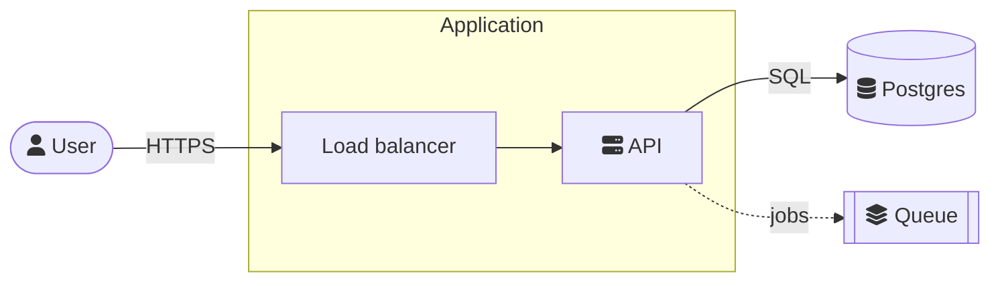

# Uber Notebook

Uber Notebook runs inside the Omarchy shell. Work with it only through
`omarchy-shell uber-notebook <command>`: the app does every write, so a page shows up
in its window as you add it, and its links and reminders work. Read and change
notes only with those commands: don't open the folders the notes are kept in
(each profile has its own), or Uber Notebook's own files and code. This skill
says everything its commands and its Markdown can do; `help` lists the commands.

Every command prints JSON (`{"ok": false, "error": "..."}` when it can't),
except `read`, which prints the page as Markdown.

| Command | What it does |
|---|---|
| `omarchy-shell uber-notebook find "<words>"` | pages with all the words, best first: `[{id, title, path, snippet}]` |
| `omarchy-shell uber-notebook list` | every page: `[{id, title, icon, path}]` (`path`: the pages it's inside) |
| `omarchy-shell uber-notebook read <id>` | the page as Markdown |
| `omarchy-shell uber-notebook add "<title>" <file.md>` | a new page in the Inbox: `{id, title, path}` |
| `omarchy-shell uber-notebook addTo <page id> "<title>" <file.md>` | a new page inside that page (`""` for the top of Pages) |
| `omarchy-shell uber-notebook append <id> <file.md>` | the Markdown added at the end of a page |
| `omarchy-shell uber-notebook blocks <id>` | the page's blocks in order: `[{id, type, depth, text}]` (`text` in Markdown, `depth`: how far inside other blocks) |
| `omarchy-shell uber-notebook replace <page id> <block id> <file.md>` | the Markdown in place of that block and the blocks inside it |
| `omarchy-shell uber-notebook insertAfter <page id> <block id> <file.md>` | the Markdown after that block (and the blocks inside it), as deep as it is |
| `omarchy-shell uber-notebook tags` | every tag: `[{tag, name, pages, blocks}]` |
| `omarchy-shell uber-notebook contacts "<words>"` | the user's people (People): `[{id, name, company, title, phones: [{label, number}], emails: [{label, email}], birthday}]`; `""` for everyone |
| `omarchy-shell uber-notebook contact "<id or name>"` | one person with their address, website, notes and the pages they're named on |
| `omarchy-shell uber-notebook addContact "<name>" "<phone>" "<email>"` | someone new in People (`""` for what you don't know); someone with that email or number already is filled in |
| `omarchy-shell uber-notebook importContacts <file>` | the people in a `.vcf` or `.csv` put in People (those there already filled in) |
| `omarchy-shell uber-notebook library <kind> "<words>"` | what's been put on the pages (the Library), newest first: `[{kind, title, detail, url, file, page, pageTitle, block, added}]`; kind `link`, `file`, `video`, `picture`, `audio`, `meeting`, `sketch`, `person` (`person`: their id), `email` or `""` for all; words `""` for all (`file` is its path on disk) |
| `omarchy-shell uber-notebook tagged "#tag"` | every block with the tag: `[{page, title, block, type, text, checked}]` |
| `omarchy-shell uber-notebook tagColor "#tag" <color>` | the tag's color: `gray`, `brown`, `orange`, `yellow`, `green`, `blue`, `purple`, `pink`, `red`, a hex like `#ff8800`, or `""` for none |
| `omarchy-shell uber-notebook projects` | every project (not the archive's): `[{id, title, status, due, progress, overdue, path}]` |
| `omarchy-shell uber-notebook project <id> <status> <due>` | makes the page a project or changes it: status `planning`, `active`, `paused`, `done` (`""` keeps it, `none` makes it a page again); due `2026-10-12`, `""` for none, `-` keeps it |
| `omarchy-shell uber-notebook events <from> <to>` | the user's calendar from `from` to `to` (`2026-10-05`; `"" ""` is today and the week on): `{events: [{id, title, start, end, allDay, place, repeats, notes}], notes: [{kind, page, title, text, at}]}` (`notes` on an event is its notes page's id; `notes` are their reminders and projects' due dates) |
| `omarchy-shell uber-notebook addEvent <what and when> <repeat>` | puts an event on the user's calendar: `"Dentist oct 12 3pm"`, `"Standup mon 9:30-9:45"`, `"Holiday dec 24"` (all day); repeat `daily`, `weekdays`, `weekly`, `monthly`, `yearly` or `""` |
| `omarchy-shell uber-notebook removeEvent <id>` | takes an event off the calendar (all of it, if it repeats). Only when the user asks |
| `omarchy-shell uber-notebook templates` | the user's templates: `[{id, title, icon, description, pages}]` (`description`: what it's for) |
| `omarchy-shell uber-notebook addTemplate "<title>" <file.md> "<description>"` | a new template from Markdown (`""` title: its `# heading`); `{{date}}`, `{{weekday}}`, `{{time}}`, `{{month}}`, `{{year}}`, `{{week}}` are filled in when it's used; description: what it's for, in a line (`""` for none) |
| `omarchy-shell uber-notebook describeTemplate <template> "<text>"` | what a template's for (its name or id), shown on its card in Templates |
| `omarchy-shell uber-notebook fromTemplate <template> <title> <parent>` | a new page from one of the user's templates (its name or id): `title` (`""` for the template's), in `parent` (`""` the Inbox, `top` the top of Pages, or a page id); `{{date}}` and the like in it are filled in. Use it when the user asks for a page "from my <name> template" |
| `omarchy-shell uber-notebook archive <id>` | puts the page (and the pages in it) away in the archive; `unarchive <id>` brings it back |
| `omarchy-shell uber-notebook trash <id>` | the page (and the pages in it) to the trash, where it can be put back |
| `omarchy-shell uber-notebook trashed` | what's in the trash: `[{id, title, in, trashed}]` (`in`: the page it was in) |
| `omarchy-shell uber-notebook restore <id>` | a page out of the trash, back where it was |
| `omarchy-shell uber-notebook rename <id> "<title>"` | the page's title |
| `omarchy-shell uber-notebook move <id> <parent> <position>` | the page inside another page (`top` for the top of Pages), at `position` among the pages there (`0` is first, `""` the end) |
| `omarchy-shell uber-notebook icon <id> <emoji>` | the page's icon: one emoji, `""` for none |
| `omarchy-shell uber-notebook cover <id> <cover>` | the page's cover: `gradient:0` to `gradient:11`, `""` for none |
| `omarchy-shell uber-notebook lock <id> true\|false` | locks the page (nothing changes it, the user's edits or yours) or unlocks it |
| `omarchy-shell uber-notebook favorite <id> true\|false` | the page in the sidebar's Favorites, or out of them |
| `omarchy-shell uber-notebook duplicate <id>` | a copy of the page (and the pages in it), right after it: `{id}` |
| `omarchy-shell uber-notebook makeTemplate <id>` | a copy of the page kept as one of the user's templates |
| `omarchy-shell uber-notebook history <id>` | the page's kept versions, newest first: `[{name, kept}]` (the first time: "ask again in a moment") |
| `omarchy-shell uber-notebook version <id> <name>` | one version, as Markdown |
| `omarchy-shell uber-notebook restoreVersion <id> <name>` | the page as that version was (the page as it is now is kept first; the pages inside it stay) |
| `omarchy-shell uber-notebook check <page id> <block id> true\|false` | ticks a to-do or unticks it |
| `omarchy-shell uber-notebook color <page id> <block id> <color>` | a block's color: `blue` (its text), `blue_background` (behind it), `""` for none; a card (board, file, video, bookmark, button, person, email) takes a hex too (`#ff8800`, `#ff8800_background`) |
| `omarchy-shell uber-notebook removeBlock <page id> <block id>` | takes the block (and the blocks inside it) off the page. Only when the user asks |
| `omarchy-shell uber-notebook board <page id> <block id> <action> <a> <b>` | changes a board: `add "<text>" "<column>"` (`""`: the first), `move <card> <column>`, `edit <card> "<text>"`, `remove <card>`, `addColumn "<name>"`, `renameColumn <column> "<name>"`, `removeColumn <column>`, `height <px>` (160 to 2000; `0` as tall as its cards), `columnWidth <column> <px>` (160 to 600; `0` as fits), `cardColor <card> <color>`, `columnColor <column> <color>` (`blue`, `#ff8800`, either with `_background`, `""` for none); a card or column by its id or its text |
| `omarchy-shell uber-notebook attach <page id> <file>` | a file at the end of the page, copied into Pages: a picture, a video, an `.eml` (an email card), any other file (a PDF shows page by page). It shows in a moment |
| `omarchy-shell uber-notebook picture <page id> <block id> <width> <align>` | a picture's size: width a percent of the page's (`15` to `100`; `"40%"` and `0.4` work too), align `left`, `center` or `right`; `""` keeps either |
| `omarchy-shell uber-notebook addGallery <page id> "<pictures>" <columns>` | a gallery at the end of the page: the pictures' full paths, one a line or `\|` between them, or a folder (its pictures, A to Z); `2`, `3` or `4` to a row (`""`: 3). They're copied into Pages; it shows in a moment |
| `omarchy-shell uber-notebook gallery <page id> <block id> <action> <a> <b>` | changes a gallery: `add "<pictures or a folder>"`, `remove <n>`, `move <n> <to>`, `caption <n> "<text>"`, `columns 2\|3\|4`, `height <px>` (80 to 800; `0` as they were); a picture by its place (`1` is first) or its `src` |
| `omarchy-shell uber-notebook bookmark <page id> <url>` | a link at the end of the page as a card with its title, a line and its picture. It shows in a moment |
| `omarchy-shell uber-notebook setLink <page id> <block id> <link>` | changes a link: a bookmark's URL (its card read again, in a moment), or a link to a page's page (its id or title) |
| `omarchy-shell uber-notebook editEvent <id> <field> <value>` | changes an event: `title`, `when` (`"fri 3pm"`, `"oct 12 9:30-10:00"`), `start`/`end` (`2026-10-05`, `2026-10-05T09:30`), `allDay`, `place`, `notes`, `repeat` (`daily`... or `""`), `alert` (minutes before: 0, 5, 10, 15, 30, 60, 120, 1440, or `none`), `color` |
| `omarchy-shell uber-notebook editContact "<id or name>" <field> "<value>"` | changes someone in People: `name`, `company`, `title`, `birthday` (`1990-04-12`, `--04-12`), `address`, `website`, `notes`; `phone`/`email` add one (`"mobile: +1 555 123 4567"`); `removePhone`/`removeEmail` take one off |
| `omarchy-shell uber-notebook removeContact <id>` | takes someone out of People. Only when the user asks |
| `omarchy-shell uber-notebook importCalendar <file.ics>` | an `.ics` file's events (a booking, an invitation, another calendar's export) on the user's calendar; those there already are skipped: `{added, skipped}` |
| `omarchy-shell uber-notebook renameTag "#tag" "#new"` | renames a tag on every page |
| `omarchy-shell uber-notebook removeTag "#tag"` | takes a tag off every page (the `#tag` comes out of the text). Only when the user asks |
| `omarchy-shell uber-notebook notebooks` | the notebooks on the shelf (Notebooks, the handwritten-style space): `[{id, title, pages, modified}]` |
| `omarchy-shell uber-notebook notebook <id>` | a notebook's pages in order: `[{id, n, title, day, text}]` (`text`: its first words) |
| `omarchy-shell uber-notebook readNotebook <id> <page id>` | a notebook's page as Markdown |
| `omarchy-shell uber-notebook addToNotebook <id> <file.md>` | a new page at the end of a notebook (headings, lists, to-dos, quotes, paragraphs) |
| `omarchy-shell uber-notebook open <id>` | shows the page in Uber Notebook's window |
| `omarchy-shell uber-notebook preferences` | every setting: `[{key, value, kind, choices, range}]` |
| `omarchy-shell uber-notebook set <key> <value>` | changes a setting (checked as Settings does): `set scrollSpeed faster`, `set paper grid`, `set colorPage "#1e1e2e"`; a list as names with commas: `set sidebarHidden "calendar,trash"` (what Pages' sidebar leaves out: `search`, `calendar`, `library`, `people`, `today`, `favorites`, `projects`, `tags`, `import`, `templates`, `archive`, `trash`; `""` puts everything back), `set sidebarFolded "projects,tags"` (its sections folded). Only when the user asks |
| `omarchy-shell uber-notebook profiles` | the user's profiles (notes kept apart): `[{id, name, folder, open, demo}]`; every other command works on the open one |
| `omarchy-shell uber-notebook profile "<name or id>"` | opens another profile. Only when the user asks (say which one you're in when it matters) |
| `omarchy-shell uber-notebook addProfile "<name>" "<folder>" true\|false` | a new profile; `""` folder for `~/Documents/Uber Notebook <name>` (an empty folder starts fresh; one with Uber Notebook's notes opens them); `true` opens it. It starts empty, with the templates |
| `omarchy-shell uber-notebook renameProfile "<name or id>" "<new name>"` | a profile's name |
| `omarchy-shell uber-notebook profileFolder "<name or id>" "<folder>"` | a profile's notes looked for in another folder (nothing is moved) |
| `omarchy-shell uber-notebook removeProfile "<name or id>"` | takes a profile off the list (not the open one); its notes stay in their folder. Only when the user asks |
| `omarchy-shell uber-notebook demo` | opens the demo profile (example pages, people, events, templates), made the first time; `restartDemo` makes it new (the old one to the trash), only when the user asks |
| `omarchy-shell uber-notebook backup "<profile>"` | a backup (one `.tar.gz` in the backup folder) of the open profile (`""`), every profile (`all`; not the demo), or one by its name or id. It's written in a moment |
| `omarchy-shell uber-notebook backups` | the backups in the backup folder, newest first: `{folder, working, last, lastFailed, backups: [{name, file, made, size, automatic}]}` |
| `omarchy-shell uber-notebook restoreBackup <file> true\|false` | puts a backup back: each profile in it a new profile, in a new folder (nothing there is changed); `true` opens the first. Only when the user asks |
| `omarchy-shell uber-notebook appVersion` | the version running and whether there's a newer one: `{version, latest, updateAvailable, status, checked, update, releases}` (`status`: `current`, `available`, `none` (no releases yet), `failed`, `idle` (not asked yet)) |
| `omarchy-shell uber-notebook checkUpdate` | asks GitHub for the newest version now; `appVersion` says what it found a few seconds later |
| `omarchy-shell uber-notebook releaseNotes` | what's new, as Markdown: the newer releases' notes, or (up to date) the notes of the version running |
| `omarchy-shell uber-notebook help` | all of this, as JSON |

## Writing a page

Content goes in as a Markdown file, by its full path (an argument can't carry a
page). An empty title (`""`) takes the file's first `# heading`. The first time
a command names a file (Markdown, contacts, a calendar), it answers "run the
same command again in a moment": the file is read for it first (only a plain
file, not a link): run the same command again. So does a page just after Uber
Notebook starts ("reading that page first"): run it again.

Working in Uber Notebook's panel (the prompt says so, and names your working
folder): write the file with your file-writing tool, in that folder, and give
its full path. There the commands go under their panel name: run each as
`omarchy-shell uber-notebook-agent <command> ...` (the same commands and
arguments as below); they read and change the user's notes, as asked; not
Uber Notebook's settings, profiles or backups. Taking things away (`trash`,
`removeContact`, `removeEvent`, `removeTag`, an `editContact` that empties
a field or removes a phone or email, an `editEvent` that empties its place
or notes) asks the user in the panel
first, one question for each thing: the answer says it's been asked
(`"asked": true`), and it's done if they say yes. A link you add is read
(for its card) only after they say yes to that link.

```bash
f=$(mktemp "$XDG_RUNTIME_DIR/uber-notebook-XXXXXX.md")
cat > "$f" <<'EOF'
# Lisbon trip

- [ ] Book the tram tour [⏰ Fri 2 Oct 9:30](uber-notebook://remind/2026-10-02T09:30)
- [x] Flights
EOF
omarchy-shell uber-notebook add "" "$f"
rm -f "$f"
```

Markdown becomes Uber Notebook's blocks: headings, paragraphs, bulleted and numbered
lists (nested), `- [ ]` and `- [x]` to-dos, code blocks with their language,
quotes, `> [!NOTE]` callouts, **bold**, *italic*, ~~struck~~, `code`, links, and:

- `[[Page title]]`: a link to the page called that (plain text when there's none)
- `[@Fri 2 Oct](uber-notebook://date/2026-10-02)`: a date
- `[⏰ Fri 2 Oct 9:30](uber-notebook://remind/2026-10-02T09:30)`: a reminder, in the
  user's local time. Omarchy shows a notification then; clicking it opens the page.
- `$E = mc^2$`: an equation in the line (LaTeX); `$$` lines around one, an
  equation of its own (see Equations below)
- `[^1]` with `[^1]: its words` at the end of the file, or `^[its words]`: a
  footnote (see Footnotes below)
- `::columns`, `::next`, `::end` lines: blocks side by side (see Columns
  below)

## Making a page look good

When the user asks for a page to look better (clearer, more beautiful, more
organized), use what Uber Notebook shows well. All of it goes in the Markdown
you `replace`, `insertAfter` or `append`, or is one command:

- Structure: `#`, `##`, `###` headings, short paragraphs, bulleted and
  numbered lists, `- [ ]` to-dos, `---` a divider between parts.
- Callouts: a quote that starts `> [!KIND]`, the kind giving its icon and
  color: `NOTE`/`INFO` and `ABSTRACT`/`SUMMARY` blue, `TIP`/`HINT` and
  `SUCCESS` green, `IMPORTANT` purple, `WARNING` and `QUESTION` yellow,
  `CAUTION`/`DANGER` and `BUG` red, `TODO`, `EXAMPLE` and `QUOTE` gray. The
  callout's text follows on the same line or in the quote's next lines.
- Toggles (a line whose content folds away): `<details><summary>Line</summary>`,
  the content, `</details>`.
- In a line: **bold**, *italic*, ~~struck~~, `==highlighted==`, `code`,
  `<u>underlined</u>`, `<span style="color: #d44c47">colored words</span>` and
  `<span style="background-color: #fbecdd">a colored background</span>`.
- Columns (blocks side by side): see Columns below.
- Tables (`| a | b |`), mind maps (```` ```mindmap ````), diagrams
  (```` ```mermaid ````), equations (`$$`), footnotes, boards, galleries
  and bookmarks: see their sections below.
- After writing: `color <page id> <block id> <color>` colors a block (`blue`
  for its text, `blue_background` behind it); `icon <page id> <emoji>` and
  `cover <page id> gradient:0` (0 to 11) give the page an icon and a cover.

Keep it restrained: a few headings, one or two callouts, color where it
means something, not on every block.

## Columns

Blocks side by side: a line `::columns`, the first column's Markdown,
`::next`, the next column's, and so on, then `::end`. Each marker is a line
of its own, with blank lines around it:

```markdown
::columns

## Pros

- Quick to set up

::next

## Cons

- Costs more

::end
```

- Two to six columns (past the sixth, what's left goes in the sixth). They
  share the width equally; `::columns 60 40` gives each its share instead
  (one number a column).
- In a column: any Markdown (headings, lists, to-dos, callouts, toggles,
  code, a table), but not more columns.
- Columns go at the page's own level: in `add` and `append`, or in
  `insertAfter` or `replace` a block that isn't inside another (one at
  `depth` 0 in `blocks`). Inside a toggle, a list or a callout, they're
  refused.
- `read` gives a page's columns the same way, so what it gives can be
  written back. In `blocks`, a `columns` block holds `column` blocks, and
  they hold the blocks in them (two deeper): change those, not the columns.
- Use them for what belongs side by side (pros and cons, before and after,
  a list beside the note it goes with), not for ordinary text, which reads
  better one block under another.

## Boards, bookmarks, links, galleries, people, agendas and events in Markdown

`read` gives these blocks as fenced code, and `add`, `append`, `replace` and
`insertAfter` take them the same way:

````markdown
```board
## To do
- Write the spec
- Fix login

## Doing

## Done
```

```bookmark
https://example.com/guide
```

```contact
Sam Rivera
```

```agenda
2026-10-05
```

```event
<an event's id, from events>
```

```link
Lisbon trip
```

```gallery
columns: 3
height: 240


```
````

A `board`'s columns are `## Name` lines, each card a `- ` line under its
column. A `contact` is someone in People: their name, email or id (someone
not in People yet keeps the name; `addContact` them first if the user wants
them kept). An `agenda` shows a day's events (`today` for whatever day it is
when it's looked at). A `link` is a link to a page, by its title or id
(`read` gives the id, then the title). A `gallery` takes pictures already in
Pages/assets (`blocks` and `read` give their `src`); to put new pictures in
one, use `addGallery` or `gallery ... add`, which copy them in. To change one
card on a board, use `board` (it keeps the board's colors), not `replace`.

## Mind maps

When the user asks for a mind map, write it as a `mindmap` code block and
Uber Notebook draws it as one: the topic on the first line, each idea on a line of
its own, indented two spaces under the idea it branches from.

````markdown
```mindmap
Launch plan
  Marketing
    Blog post
    Newsletter
  Engineering
    Release notes
```
````

Keep each idea to a few words. A map holds up to 300 ideas, 8 levels deep.

An idea can have a text color and a background, in braces at the end of its
line: `Marketing {red}`, `Marketing {blue background}`, or both,
`Marketing {red, yellow background}`. The colors are gray, brown, orange,
yellow, green, blue, purple, pink and red, which follow the user's light or
dark theme, or any hex color (`{#ff8800}`, `{#1e66f5 background}`), which
stays as it is; Uber Notebook makes text readable on any background that has no
text color of its own. A main idea's color (its
background's, else its text's) colors its whole branch, so color the main
ideas when the user asks for a colored map; with none, each branch gets a
color of its own.
Mermaid's `mindmap` syntax (in a `mermaid` block) is read too. `read` and
`blocks` give a map back the same way (`blocks`: its `text`); to change one,
`replace` its block with a new `mindmap` block.

## Equations

Equations are LaTeX, drawn by MathJax: `$…$` in a line of text, and `$$`
lines around an equation of its own (or a ```` ```math ```` block). The
common packages work (AMS environments like `aligned`, `cases`, `pmatrix`;
`\mathbb`, `\boldsymbol`, `\cancel`, `\color`, `\newcommand`).

```markdown
The energy is $E = mc^2$, and the roots are

$$
x = \frac{-b \pm \sqrt{b^2 - 4ac}}{2a}
$$
```

An equation of its own is a code block in `Math` (`blocks` gives its LaTeX
as its `text`); one in a line comes back from `read` and `blocks` as `$…$`.
A `$` with a space after it, or a digit after the closing one, isn't an
equation, so "$5 and $10" stays money.

## Diagrams

Decision trees, network diagrams, system diagrams and flowcharts are
Mermaid flowcharts in a `mermaid` block, drawn in the page (a code block in
`Mermaid`; `blocks` gives what's written as its `text`). Start with
`flowchart TD` (top down) or `flowchart LR` (left to right).

````markdown

````

- Shapes: `[box]`, `(rounded)`, `([pill])`, `[[subroutine]]`, `[(database)]`,
  `((circle))`, `{question}` (a decision), `{{hexagon}}`, `[/slanted/]`, `>flag]`.
- Links: `-->`, `---` (no arrow), `-.->` (dotted), `==>` (thick), `<-->`,
  with words `-->|yes|` or `-- yes -->`; `A & B --> C`; `--->` is a rank longer.
- Groups: `subgraph id [Name]` … `end` (inside each other too).
- Icons, at the start of a box's words: `fa:fa-server`, `fa:fa-database`,
  `fa:fa-cloud`, `fa:fa-globe`, `fa:fa-user`, `fa:fa-users`, `fa:fa-laptop`,
  `fa:fa-desktop`, `fa:fa-mobile`, `fa:fa-network-wired` (a switch),
  `fa:fa-router`, `fa:fa-fire` (a firewall), `fa:fa-wifi`, `fa:fa-shield`,
  `fa:fa-lock`, `fa:fa-key`, `fa:fa-hdd`, `fa:fa-docker`, `fa:fa-kubernetes`,
  `fa:fa-layer-group` (a queue), `fa:fa-cogs`, `fa:fa-envelope`, `fa:fa-code`.
- A decision tree: questions in `{…}`, the answers on the links (`-->|Yes|`),
  top down.
- Colors, when the user asks for them (a diagram is drawn in the page's ink
  otherwise): `style id fill:#dbeafe,stroke:#2563eb,color:#1e3a8a` for one
  box (or a group, by its id); `classDef name fill:…,stroke:…,color:…` with
  `class a,b name` (or `a:::name`) for several, `classDef default …` for
  every box; `linkStyle 0,2 stroke:#dc2626,stroke-width:2px` for lines
  (numbered from 0 in the order they're written) or `linkStyle default …`.
  `stroke-width`, `stroke-dasharray: 5 5` and `font-weight:bold` work too.
  Give a `color` with each `fill`; words and lines are kept readable on a
  light or a dark page.

Only flowcharts are drawn: a `sequenceDiagram`, `classDiagram` and the like
stays as it's written, with a line saying so. Keep a diagram to a few dozen
boxes (one wider than the page is drawn smaller to fit it, and the user can
open it large and zoom in). To change one, `replace` its block with a new
`mermaid` block. There's no command that makes a diagram (or an equation) a
picture: when the user wants one, tell them to point at it and click *Save
as a picture…* (a PNG) or *Copy as a picture*, or open it large and press
Ctrl+S or Ctrl+C.

## Footnotes

A footnote is `[^1]` where it belongs, with `[^1]: its words` at the end of
the file, or `^[its words]` right there. Uber Notebook numbers them down the
page (the same words twice are one footnote) and lists them at its end.
A footnote's words are plain text: Markdown's marks in them (`*italics*`,
`**bold**`) are dropped, and a link becomes its words with its address after.
`read` gives them back as `[^1]` with their words at the end; `blocks`, a
block at a time, as `^[its words]`.

## Tables

A Markdown table is a table in Uber Notebook, its first row the header row. A
cell can have **bold**, *italic*, links and `<br>` for a new line in it.
`read` and `blocks` give a table back as Markdown (`blocks`: its `text`); to
change one, `replace` its block with the whole table as you want it. Cell
colors are set in Uber Notebook and aren't in the Markdown, so replacing a colored
table takes its colors off: say so when you do.

```markdown
| Item    | Planned | Spent |
|---------|---------|-------|
| Flights | €420    | €398  |
| Hotel   | €360    |       |
```

## Sketches

A page can have sketches (drawings the user made). `blocks` lists one as
type `sketch`, text `(a drawing)`, and `read` as `*(A sketch, drawn in
Uber Notebook)*`. You can't draw one or see what's in it; don't `replace` a sketch's
block unless the user asks for the drawing to go.

## Audio notes

A page can have audio notes (recordings the user made in Uber Notebook). `blocks`
lists one as type `audio`, with `src` (its file in `Pages/assets`),
`duration` (seconds) and `text`: what was said in it, as voxtype wrote it
out, or `(an audio note, 1:42, not written out)`. `read` shows it as a link
to the file with what was said quoted under it. That text is the note's
transcript: use it to summarize a recording, pull out to-dos or answer what
was said. You can't record or play one; don't `replace` an audio note's block
unless the user asks for it to go.

## Boards, files, bookmarks, buttons, synced blocks

`blocks` lists these with their words in `text`: a `board` as Markdown (a
column a bold line, its cards a list), a `bookmark` as its link (and `url`),
a `file` or `video` as its name and size (and `src`, in Pages/assets), a
`button` as its words. A `synced` block's `text` names the page its blocks
are on (`synced`): `read` or `blocks` that page for what it says, and change
it there (it changes everywhere the synced block is). A board's block in
`blocks` has `board: {columns: [{id, name, cards: [{id, text}]}]}`: change its
cards and columns with `board`. Don't `replace` these blocks unless the user
asks. `attach` and `bookmark` put a file or a link card on a page; `setLink`
changes a bookmark's link, or which page a link to a page goes to.

People: `contacts` and `contact "Sam"` answer "what's Sam's number?" and
"who's at Acme?". In Markdown a person on a page is
`[@Sam Rivera](uber-notebook://contact/<id>)` (keep those links as they are; to
name someone, use their id from `contacts`). Add or change people only when
the user asks (`addContact`, `importContacts`, `editContact`), and take
someone out (`removeContact`) only when they say to.

An `email` block is a saved email (an .eml in Pages/assets): `blocks` gives
its subject, from, to, date and first lines in `text` (and `src`, the
file); `library email` lists every saved email with the page it's on.

`library` lists everything on the pages in one go (the app's Library):
bookmarks and links written in text, files and PDFs, videos, pictures,
audio notes, meetings and sketches, each with the page it's on. Use it for
"which PDFs do I have", "that link about…", "where's the video of…"; a
file's `file` is its path, to read it if the user asks (a PDF with
`pdftotext`, say).

## Pictures and galleries

A picture's block in `blocks` has `src` (in Pages/assets), `width` (a percent
of the page's) and `align`. When the user asks for a picture smaller, bigger
or to one side, use `picture` ("make the map half as wide" is
`picture <page> <block> 50 ""`). For several pictures, `addGallery` makes a
grid of them (a folder works: "make a gallery of ~/Pictures/Lisbon"), and
`gallery` adds, removes, reorders and captions them or changes its columns
and height. In `blocks` a gallery has `images` (`[{src, caption}]`),
`columns` and `height`. Pictures are copied in: the originals stay where
they are.

To give the user a picture from their notes ("save that picture to my
Downloads", "put it on my clipboard"): `library pictures "<words>"` gives its
`file` (a full path; a block's `src` is in `Pages/` in the `folder` that
`status` gives). Copy that file where they say, keeping its ending, or put
it on the clipboard with `wl-copy --type image/png < "<file>"` (`image/jpeg`
for a .jpg). They can also do it themselves: a click on a picture shows its
bar, with *Copy* and *Save a copy…*.

## Templates

`templates` lists the user's templates with what each is for. Make one only
when the user asks (`addTemplate` from Markdown, or `makeTemplate` from a
page they have), and give it a `description` so it reads well in Templates.
`fromTemplate` makes a page from one.

## Settings

`preferences` lists every setting with its value and what it can be
(`choices`, or a `range`); `set <key> <value>` changes one, as the Settings
panel would (Uber Notebook's window follows at once). Change settings only when
the user asks ("scroll faster" is `set scrollSpeed faster`; the colors
`colorSidebar`, `colorPage`, `colorCards`, `colorText` take a hex, `""` for
the theme's). Profiles have their own commands (`profiles`, `addProfile`...),
not `set`.

## Backups and updates

When the user asks to back up their notes, `backup ""` backs up the open
profile and `backup all` every profile; then `backups` shows it (with
`last` saying how it went). Say where it went (`folder`). Automatic backups
are a setting (`set backupEvery daily`, `weekly` or `off`; `set backupKeep
10`); change them only when asked. `restoreBackup` never changes anything
there is: each profile in the backup comes back as a new one, in a new
folder; use it only when the user asks, and tell them the new profiles'
names (`profiles`).

"Is there a new version?" is `checkUpdate`, then `appVersion` a few seconds
later; `releaseNotes` says what's in it. Uber Notebook doesn't install
updates: tell the user the command in `update`, to run in a terminal (it shows
what changes and asks before it applies them).

## Meetings

A page can have meetings, recorded by voxtype's meeting mode. `blocks` lists
one as type `meeting`, with `title`, `duration` (seconds) and `text`: who
said what, a turn a line (`Sam (0:12): The notes are done.`; "You" is the
user, "Remote" the other side of a call unless they named them), or
`(a meeting recorded with voxtype, not written out yet)` while it's going.
When the user asks you to summarize a meeting (Uber Notebook's Summarize button
asks you this way), read it and put right after its block: a short summary,
the decisions, and the action items as to-dos (`- [ ] Sam: screenshots by
Thursday`). Don't change or `replace` the meeting block itself.

## Projects

A page can be a project: a status (planning, active, paused, done), a due
date, and its progress (the to-dos on it and on the pages inside it). Make
one with `project <id> active 2026-10-12`, or write front matter at the top
of the Markdown you `add`:

```markdown
---
status: active
due: 2026-10-12
---
# Q4 launch
```

`projects` lists them, late ones with `overdue: true`. When the user says a
project is finished, set it `done`; `archive` it only when they ask.

## Tags

`#name` in a line is a tag (letters, digits, `-`, `_`, `/`; not only digits;
not in code): `- [ ] renew passport #errand`. Use the user's tags (`tags`
lists them) rather than making near-duplicates, and only tag when the user
asks or the page already uses tags. `tagged "#errand"` gives every block with
a tag (to-dos with `checked`), and `read` gives tags back as `#name`.
`tags` says each tag's `color` (a tag with none of its own takes the color of
the tag it's in: `#work/acme` takes `#work`'s, and says `colorFrom`). Color
tags with `tagColor` only when the user asks.

## Changing blocks on a page

`blocks <id>` gives each block's id. `replace` puts your Markdown in place of a
block and everything inside it; `insertAfter` puts it after them. Both keep the
block's depth. Neither works on columns themselves (change the blocks inside
them), and `replace` won't take a block with pages inside it. Markdown with
columns goes only after or in place of a block at depth 0 (see Columns).

## Pages, the trash and history

Rename, move, lock, restore and copy pages when the user asks. Nothing a
command does deletes a page for good: `trash` can be undone with `restore`,
and before a command changes a page its version is kept (`history`,
`version`, `restoreVersion`), so "undo what you did to my page" is
`restoreVersion` with the version kept just before. A locked page refuses
every change until it's unlocked; unlock one only when the user asks.

## Notebooks

Besides Pages, Uber Notebook has Notebooks: handwritten-style notebooks on a
shelf (a journal, say). `notebooks`, `notebook <id>` and `readNotebook` read
them; `addToNotebook` adds a page at the end of one. A notebook's page holds
simple blocks (headings, lists, to-dos, quotes, paragraphs), not boards or
tables. Write in a notebook only when the user names it.

## When Uber Notebook asks you

The user can ask you from inside Uber Notebook ("Ask agent", Ctrl+J). The prompt
names the page and what they picked: blocks by id, the words they selected
(in a block, by its id), or an empty line by its block id, which is where your
writing goes (`replace` that block). Read what you need with `blocks` or
`read`, make the change, and say what you did.

Or they asked for a new page: Uber Notebook has made it (empty, and open in
front of them) and the prompt gives its id. Write it there: `rename` it to say
what it is, an `icon` if one fits, and `append` what goes on it. Don't `add`
another page, and don't append to an existing one instead (the "look before
you write" rule doesn't apply: they chose a new page).

They can reply in the panel, and their reply comes to you in the same
conversation (now, or later: each page keeps its conversation, even after
Uber Notebook starts again): just their words, or first where they are now
when that's changed ("I'm on another page now: … (page id …)", the blocks or words
they've picked since). If you need something from them to do it well (which
city, which pages), ask in your answer and stop: they'll reply.

## Rules

- Look before you write: `find` first, and `append` to a page that's already
  about the subject rather than making a second one.
- Put a page where the user says (`find` the page they name, then `addTo` it);
  otherwise `add` puts it in the Inbox.
- Tell the user the page's title and where it went (`path`).
- Never `trash` a page unless the user asked for that page to go.
- A locked page can't be changed: say so, and don't work around it.
- Uber Notebook keeps the page as it was (its *Page history*) before each change
  you make, so the user can put it back; still, change only what was asked.
- If a command says the pages aren't loaded yet, or omarchy-shell isn't
  running, wait a moment and try once more. Don't fall back to editing files.
- Don't read Uber Notebook's code or its notes' files to learn what it can
  do: this skill and `help` say it all, and the commands are quicker.
